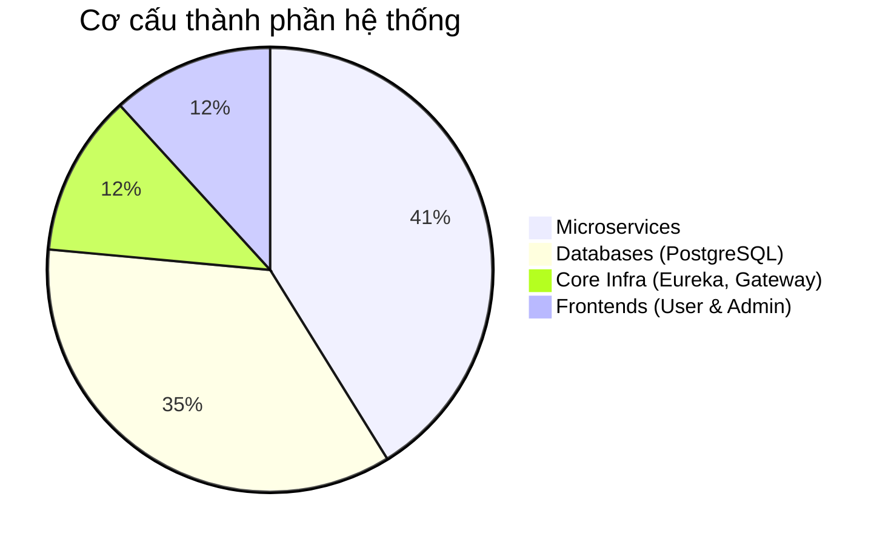
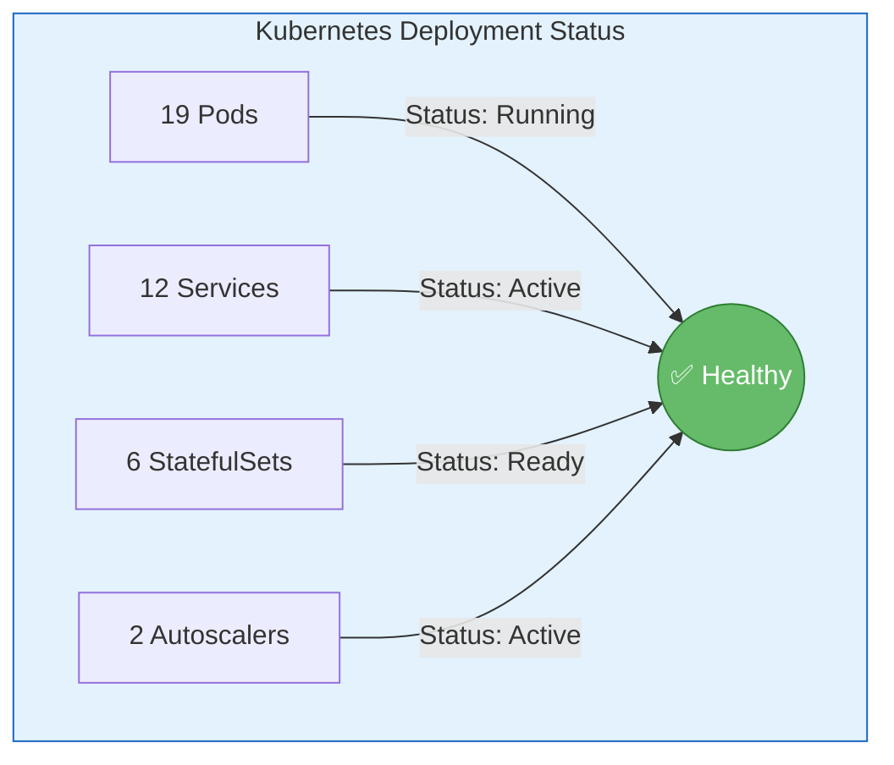
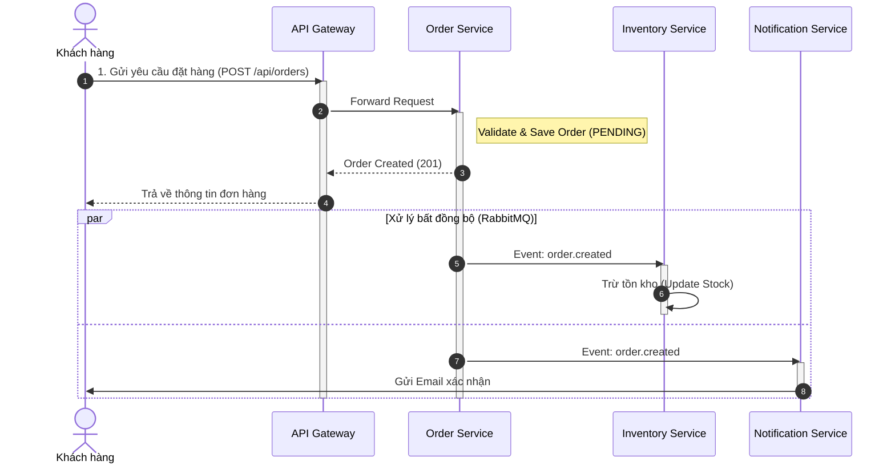

# Chương 9: KẾT QUẢ VÀ DEMO

## 9.1 Tổng quan kết quả

Hệ thống đã được hoàn thiện và triển khai thành công, đáp ứng đầy đủ các yêu cầu chức năng và phi chức năng. Các thành phần của hệ thống hoạt động ổn định và có sự liên kết chặt chẽ.

Dưới đây là biểu đồ phân bố các thành phần chính trong hệ thống:

**Bảng thống kê chi tiết:**

| Tiêu chí | Số lượng | Chi tiết |
|----------|----------|----------|
| **Microservices** | 7 | Auth, Menu, Order, Payment, Inventory, Notification, Gateway |
| **Databases** | 6 | PostgreSQL instances (Mỗi service một DB riêng biệt) |
| **Docker Containers** | 15+ | Bao gồm các services, databases và message broker |
| **Kubernetes Pods** | 19 | Đảm bảo tính sẵn sàng cao (High Availability) |
| **API Endpoints** | 30+ | Các REST API phục vụ nghiệp vụ |

---

## 9.2 Kết quả triển khai Kubernetes

Hệ thống đã được deploy thành công lên Kubernetes Cluster. Trạng thái các tài nguyên (Resources Status) được ghi nhận như sau:

- **Pods Status:** 100% Running & Ready.
- **Service Discovery:** Các services nhìn thấy nhau thông qua Eureka Server nội bộ.
- **Data Persistence:** Các StatefulSet của PostgreSQL hoạt động ổn định với Persistent Volumes.

---

## 9.3 Demo Kịch bản: Đặt hàng thành công

Để kiểm chứng hoạt động của hệ thống, kịch bản "Đặt hàng" (Order Placement) đã được thực hiện. Quy trình xử lý đi qua nhiều services và được thể hiện qua biểu đồ tuần tự sau:

---

## 9.4 Kết quả kiểm thử hiệu năng (Performance)

Kết quả đo thời gian phản hồi (Response Time) trung bình của các API quan trọng:

```mermaid
gantt
    title Thời gian phản hồi API (ms)
    dateFormat X
    axisFormat %s
    
    section Read API
    Get Menu List       : 0, 85
    Get Order Detail    : 0, 120
    
    section Write API
    Login               : 0, 150
    Create Order        : 0, 320
```

**Nhận xét:** Hệ thống xử lý tốt với độ trễ thấp, đảm bảo trải nghiệm người dùng mượt mà.
