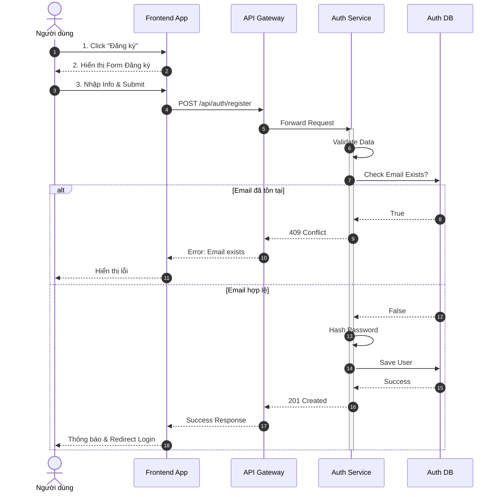
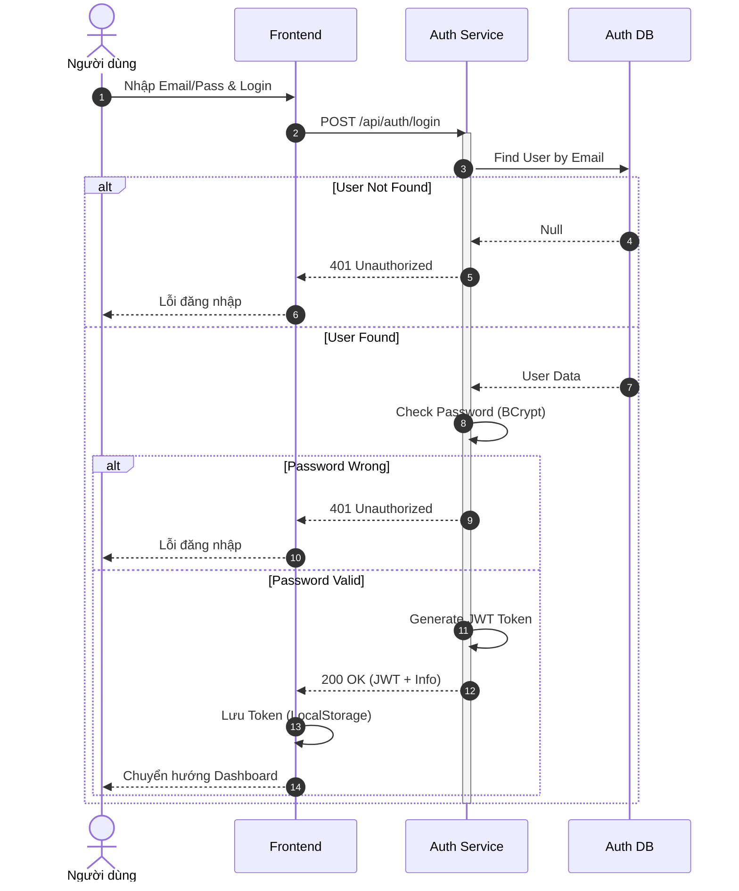
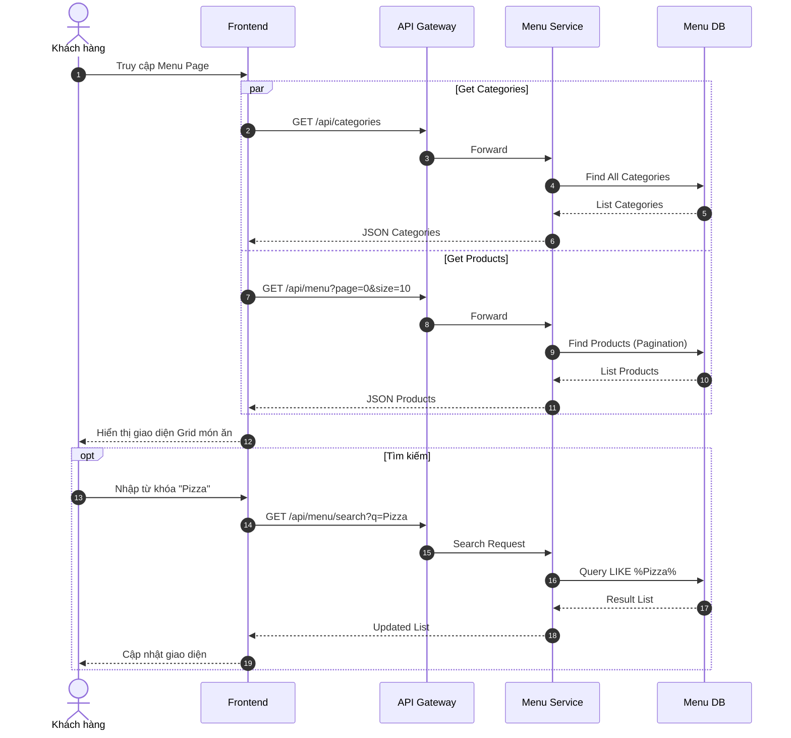
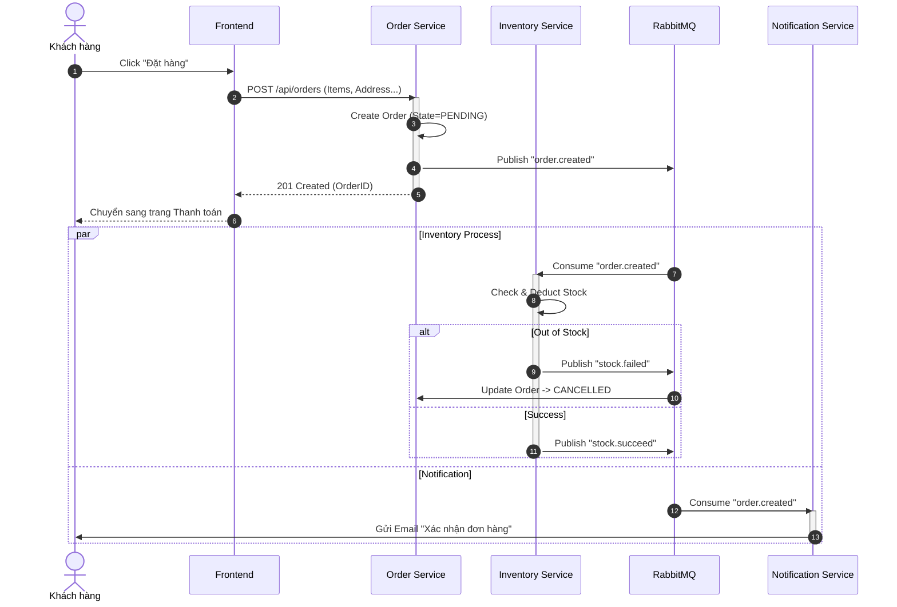
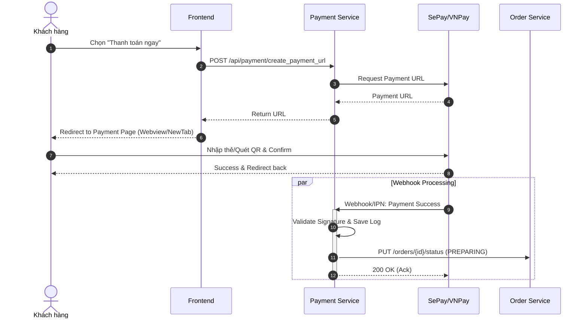
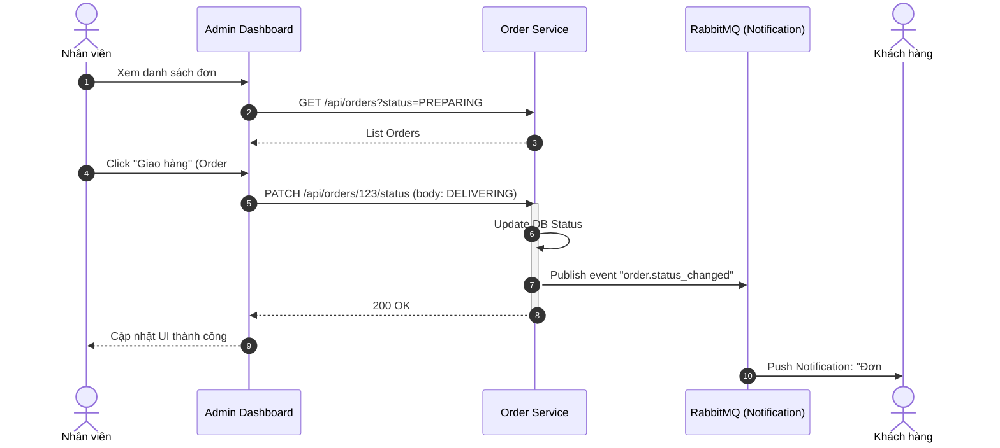

# MÔ TẢ CHI TIẾT CÁC CHỨC NĂNG HỆ THỐNG

Dưới đây là các bảng mô tả chi tiết quy trình nghiệp vụ (Use Case Specifications) và biểu đồ tuần tự (Sequence Diagrams) cho các chức năng cốt lõi của **Hệ thống đặt món ăn trực tuyến**.

---

## 1. UC_DangKy: Đăng ký tài khoản

### Bảng mô tả chi tiết

| Thuộc tính | Chi tiết |
| :--- | :--- |
| **Mã Use case** | `UC_DangKy` |
| **Tên Use case** | Đăng ký tài khoản khách hàng |
| **Tác nhân** | Khách hàng (Vãng lai) |
| **Mô tả** | Cho phép khách hàng mới tạo tài khoản để sử dụng các dịch vụ đặt món. |
| **Sự kiện kích hoạt** | Người dùng bấm nút "Đăng ký" trên trang chủ hoặc trang đăng nhập. |
| **Tiền điều kiện** | Người dùng chưa đăng nhập. |
| **Hậu điều kiện** | Tài khoản mới được tạo, lưu vào CSDL và người dùng có thể đăng nhập. |

#### Luồng sự kiện chính (Main Flow)

| # | Thực hiện bởi | Hành động |
|---|---|---|
| 1 | Người dùng | Nhấn chọn chức năng "Đăng ký" trên giao diện. |
| 2 | Hệ thống | Hiển thị form đăng ký (Email, Password, Full Name, Phone). |
| 3 | Người dùng | Nhập đầy đủ thông tin vào form và nhấn "Gửi". |
| 4 | Hệ thống | Kiểm tra tính hợp lệ của dữ liệu (Format email, độ dài mật khẩu...). |
| 5 | Hệ thống | Kiểm tra email đã tồn tại trong hệ thống chưa (Call Auth Service). |
| 6 | Hệ thống | Tạo tài khoản mới, mã hóa mật khẩu và lưu vào Database. |
| 7 | Hệ thống | Thông báo "Đăng ký thành công" và chuyển hướng về trang đăng nhập. |

#### Luồng sự kiện thay thế (Alternative Flow)

| # | Tình huống | Hành xử của hệ thống |
|---|---|---|
| 4a | Dữ liệu không hợp lệ | Hiển thị thông báo lỗi cụ thể tại trường nhập liệu tương ứng và yêu cầu nhập lại (Quay lại B3). |
| 5a | Email đã tồn tại | Hiển thị thông báo "Email này đã được sử dụng" và yêu cầu dùng email khác (Quay lại B3). |

### Biểu đồ tuần tự (Sequence Diagram)

---

## 2. UC_DangNhap: Đăng nhập hệ thống

### Bảng mô tả chi tiết

| Thuộc tính | Chi tiết |
| :--- | :--- |
| **Mã Use case** | `UC_DangNhap` |
| **Tên Use case** | Đăng nhập |
| **Tác nhân** | Khách hàng, Admin, Staff |
| **Mô tả** | Xác thực danh tính người dùng để truy cập vào các chức năng được phân quyền. |
| **Sự kiện kích hoạt** | Người dùng mở ứng dụng hoặc truy cập chức năng yêu cầu xác thực. |
| **Tiền điều kiện** | Đã có tài khoản được kích hoạt trên hệ thống. |
| **Hậu điều kiện** | Người dùng nhận được JWT Token và truy cập được Homepage/Dashboard. |

#### Luồng sự kiện chính

| # | Thực hiện bởi | Hành động |
|---|---|---|
| 1 | Người dùng | Nhập Email và Mật khẩu vào form đăng nhập, nhấn "Đăng nhập". |
| 2 | Hệ thống | Gửi yêu cầu xác thực đến Auth Service. |
| 3 | Hệ thống | Kiểm tra thông tin đăng nhập trong Database. |
| 4 | Hệ thống | So khớp mật khẩu (đã mã hóa). |
| 5 | Hệ thống | Tạo JWT Token (chứa UserID, Roles) và Refresh Token. |
| 6 | Hệ thống | Trả về Token và thông tin cơ bản của User. |
| 7 | Người dùng | Nhận thông báo thành công và chuyển vào trang chủ. |

#### Luồng sự kiện thay thế

| # | Tình huống | Hành xử của hệ thống |
|---|---|---|
| 3a | Email không tồn tại | Thông báo "Tài khoản hoặc mật khẩu không chính xác". |
| 4a | Sai mật khẩu | Thông báo "Tài khoản hoặc mật khẩu không chính xác". |

### Biểu đồ tuần tự

---

## 3. UC_XemMenu: Xem danh sách món ăn

### Bảng mô tả chi tiết

| Thuộc tính | Chi tiết |
| :--- | :--- |
| **Mã Use case** | `UC_XemMenu` |
| **Tên Use case** | Xem và tìm kiếm món ăn |
| **Tác nhân** | Khách hàng, Khách vãng lai |
| **Mô tả** | Cho phép người dùng xem danh sách món ăn, lọc theo danh mục hoặc tìm kiếm theo tên. |
| **Sự kiện kích hoạt** | Người dùng truy cập trang chủ hoặc trang thực đơn. |
| **Tiền điều kiện** | Hệ thống Menu Service đang hoạt động. |
| **Hậu điều kiện** | Danh sách món ăn được hiển thị. |

#### Luồng sự kiện chính

| # | Thực hiện bởi | Hành động |
|---|---|---|
| 1 | Người dùng | Truy cập vào màn hình "Thực đơn". |
| 2 | Hệ thống | Gửi yêu cầu lấy danh sách danh mục (Categories) và món ăn (Products). |
| 3 | Hệ thống | Truy vấn dữ liệu từ Menu Database. |
| 4 | Hệ thống | Trả về danh sách món ăn, hình ảnh, giá. |
| 5 | Người dùng | Xem danh sách, có thể chọn bộ lọc Category hoặc gõ từ khóa tìm kiếm. |
| 6 | Hệ thống | Cập nhật danh sách hiển thị theo điều kiện lọc/tìm kiếm. |

### Biểu đồ tuần tự

---

## 4. UC_DatHang: Đặt món (Tạo đơn hàng)

### Bảng mô tả chi tiết

| Thuộc tính | Chi tiết |
| :--- | :--- |
| **Mã Use case** | `UC_DatHang` |
| **Tên Use case** | Đặt hàng (Checkout) |
| **Tác nhân** | Khách hàng (Đã đăng nhập) |
| **Mô tả** | Người dùng chọn món, xác nhận giỏ hàng và tạo đơn hàng mới. |
| **Sự kiện kích hoạt** | Người dùng nhấn nút "Đặt hàng" hoặc "Thanh toán" từ giỏ hàng. |
| **Tiền điều kiện** | Giỏ hàng không rỗng, người dùng đã đăng nhập. |
| **Hậu điều kiện** | Đơn hàng được tạo ở trạng thái PENDING, tồn kho được giữ (reserved). |

#### Luồng sự kiện chính

| # | Thực hiện bởi | Hành động |
|---|---|---|
| 1 | Người dùng | Xem lại giỏ hàng, chọn địa chỉ giao hàng và nhấn "Xác nhận đặt hàng". |
| 2 | Hệ thống | Validate thông tin đơn hàng (Sản phẩm, số lượng, giá). |
| 3 | Hệ thống | Gọi Order Service để tạo đơn hàng (Status: PENDING). |
| 4 | Hệ thống | Order Service publish sự kiện `order.created`. |
| 5 | Hệ thống | Inventory Service lắng nghe, kiểm tra & trừ tồn kho. |
| 6 | Hệ thống | Notification Service lắng nghe, gửi email xác nhận cho khách. |
| 7 | Hệ thống | Trả về mã đơn hàng và chuyển hướng sang trang thanh toán. |

#### Luồng sự kiện thay thế

| # | Tình huống | Hành xử của hệ thống |
|---|---|---|
| 5a | Hết hàng | Inventory Service báo lỗi -> Order Service cập nhật trạng thái CANCELLED -> Thông báo cho người dùng "Món ăn đã hết". |

### Biểu đồ tuần tự

---

## 5. UC_ThanhToan: Thanh toán đơn hàng

### Bảng mô tả chi tiết

| Thuộc tính | Chi tiết |
| :--- | :--- |
| **Mã Use case** | `UC_ThanhToan` |
| **Tên Use case** | Thanh toán trực tuyến |
| **Tác nhân** | Khách hàng |
| **Mô tả** | Thực hiện thanh toán cho đơn hàng đã tạo thông qua cổng thanh toán (Mock/VNPay). |
| **Sự kiện kích hoạt** | Người dùng chọn phương thức thanh toán và nhấn "Thanh toán". |
| **Tiền điều kiện** | Đơn hàng tồn tại và ở trạng thái PENDING/CONFIRMED. |
| **Hậu điều kiện** | Giao dịch được ghi nhận, đơn hàng cập nhật trạng thái PAID/PREPARING. |

#### Luồng sự kiện chính

| # | Thực hiện bởi | Hành động |
|---|---|---|
| 1 | Người dùng | Chọn phương thức thanh toán (VD: Thẻ/QR) tại trang thanh toán. |
| 2 | Hệ thống | Payment Service tạo URL thanh toán (hoặc QR Code) từ 3rd Party Gateway. |
| 3 | Người dùng | Thực hiện quét mã/nhập thẻ trên cổng thanh toán. |
| 4 | Cổng TT | Xử lý giao dịch và gọi Webhook về Payment Service (IPN). |
| 5 | Hệ thống | Payment Service xác nhận tiền về, lưu Transaction Log. |
| 6 | Hệ thống | Payment Service gọi Order Service cập nhật trạng thái đơn -> PREPARING. |
| 7 | Hệ thống | Thông báo "Thanh toán thành công" cho người dùng. |

### Biểu đồ tuần tự

---

## 6. UC_QuanLyDon: Xử lý đơn hàng (Staff)

### Bảng mô tả chi tiết

| Thuộc tính | Chi tiết |
| :--- | :--- |
| **Mã Use case** | `UC_QuanLyDon` |
| **Tên Use case** | Cập nhật trạng thái đơn hàng |
| **Tác nhân** | Nhân viên (Staff/Admin) |
| **Mô tả** | Nhân viên bếp/quản lý cập nhật tiến độ đơn hàng (Đang chuẩn bị -> Đã xong -> Giao hàng). |
| **Sự kiện kích hoạt** | Nhân viên thao tác trên Admin Dashboard. |
| **Tiền điều kiện** | Nhân viên đã đăng nhập với quyền STAFF. |
| **Hậu điều kiện** | Trạng thái đơn hàng thay đổi, khách hàng nhận được thông báo cập nhật. |

#### Luồng sự kiện chính

| # | Thực hiện bởi | Hành động |
|---|---|---|
| 1 | Nhân viên | Xem danh sách đơn hàng "Chờ xử lý" (PREPARING). |
| 2 | Nhân viên | Sau khi nấu xong, nhấn nút chuyển trạng thái "Đã xong/Chờ giao" (DELIVERING). |
| 3 | Hệ thống | Cập nhật trạng thái trong Database. |
| 4 | Hệ thống | Gửi thông báo realtime (qua WebSocket hoặc RabbitMQ -> Notification) tới khách hàng. |
| 5 | Khách hàng | Nhận được thông báo "Món ăn của bạn đang được giao". |

### Biểu đồ tuần tự

